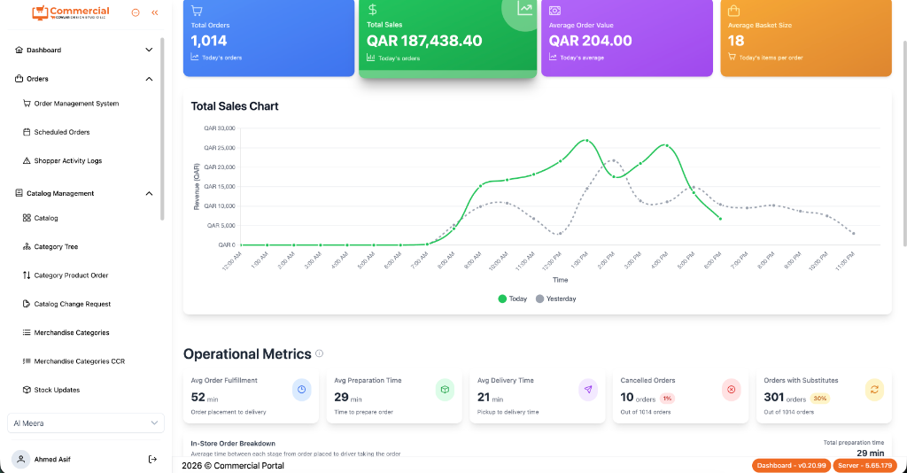

# Fahad Khan — Full-Stack Systems Engineer

> High-concurrency systems, real-time event-driven backends, and IoT telemetry pipelines.



## Overview

Live personal portfolio designed in the Abiha Rasheed aesthetic with interactive 2D physics simulation, dark/light theme switching, responsive bento grids, and comprehensive case studies.

## Core Specializations

- **High-Concurrency Systems**: FastAPI, Go, Kafka, Redis, and event queues sustaining 100k+ events/sec.
- **Real-Time IoT Telemetry**: Traccar-based TCP/UDP listeners, sub-second kinematics ingestion, and geofencing.
- **Production Full-Stack SaaS**: Next.js (App Router), PostgreSQL with optimized indexing, Celery background workers, Docker, and Kubernetes.
- **Academic Distinction**: COMSATS Gold Medalist (BSCS 3.82 CGPA) and Bronze Medalist.

## Featured Works

1. **Commercial Retail OS Portal**: Multi-branch enterprise commerce platform with live inventory reconciliation.
2. **Enterprise Loyalty & Rewards Platform**: Real-time points ledger, fraud prevention, and POS integration.
3. **Vupop Sports Video Streaming Engine**: Microsecond live video engagement engine with per-second billing.
4. **Aqarat Real Estate Tech Pilot**: Property valuation engine with automated escrow and verification workflows.
5. **Boxtech B2B Operations Suite**: Multi-tenant logistics and procurement engine.
6. **Real-Time IoT Kinematics & Traccar Platform**: Distributed vehicle telemetry engine processing high-frequency GPS bursts.

## Tech Stack

- **Frontend**: HTML5, Canvas API, Tailwind CSS, Bricolage Grotesque, Hanken Grotesk, JetBrains Mono
- **Backend**: Python (FastAPI / Django), Node.js, Go
- **Data & Streaming**: PostgreSQL, Redis, Kafka, RabbitMQ, Docker
- **Protocols**: REST, WebSockets, gRPC, TCP/UDP Telemetry

## Deployment

Deployable instantly on Vercel, Netlify, or GitHub Pages. Zero build step required.

```bash
# Clone the repository
git clone https://github.com/fadikhan51/portfolio.git

# Open directly in browser
open index.html
```

## Contact

- **GitHub**: [@fadikhan51](https://github.com/fadikhan51)
- **LinkedIn**: [Fahad Khan](https://www.linkedin.com/in/fahad-khan-13ab35249)
